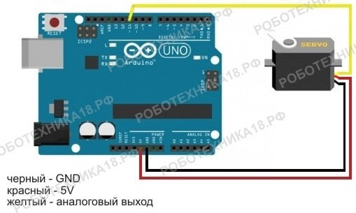
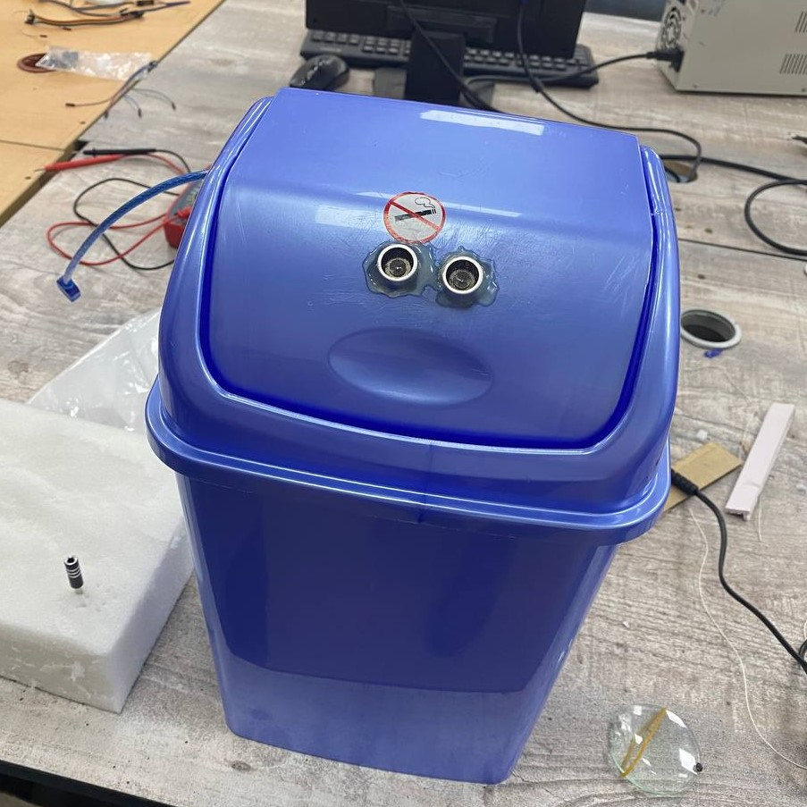

#  Automated bin for no-touching use

#### Arduino Uno was taken as core for bucket project

#### Scheme we used to connect parts to work together

#### Finally we got this one

#### To try you have to
1. сonnect it to an outlet
2. run your hand over the sensor
3. enjoy the usefulness